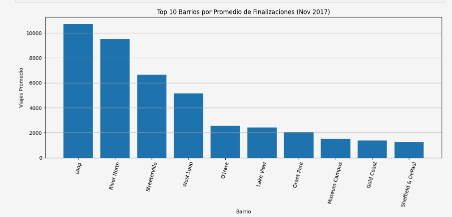
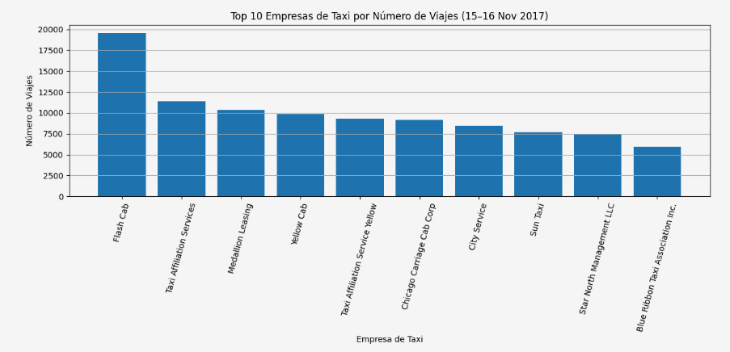

# Análisis de demanda y duración de viajes en taxi (Chicago) — SQL + Python

## Descripción del proyecto
Este proyecto analiza patrones de demanda en viajes de taxi en Chicago y evalúa si las condiciones climáticas afectan la duración de los viajes.  
El objetivo es replicar un escenario real de análisis para roles como **Marketing Analytics / Growth / BI**, donde se combinan **SQL + Python** para extraer, explorar y validar hallazgos con datos.

---

## Objetivo
1. Identificar las **compañías con mayor volumen de viajes**.
2. Identificar las **zonas de destino con mayor promedio de viajes**.
3. Validar mediante un **test de hipótesis** si la duración de viajes desde **Loop → O’Hare** cambia significativamente cuando el clima es “Bad” vs “Good”.

---

## Herramientas y librerías
- SQL (extracción y agregación de datos)
- Python: `pandas`, `numpy`
- Visualización: `matplotlib`, `seaborn`
- Estadística: `scipy` (test de hipótesis)

---

## Metodología
1. **Carga y validación** de resultados SQL en CSV.
2. **EDA** (distribuciones, comparaciones y detección de valores atípicos).
3. Rankings:
   - Top compañías por número de viajes.
   - Top zonas de destino por promedio de viajes.
4. **Test de hipótesis (Welch t-test)** sobre duración (segundos) bajo clima Good vs Bad.

---

## Resultados principales

### 1) Top compañías por cantidad de viajes (Top 10)
1. Flash Cab — 19558  
2. Taxi Affiliation Services — 11422  
3. Medallion Leasin — 10367  
4. Yellow Cab — 9888  
5. Taxi Affiliation Service Yellow — 9299  
6. Chicago Carriage Cab Corp — 9181  
7. City Service — 8448  
8. Sun Taxi — 7701  
9. Globe Taxi — 7383  
10. Blue Ribbon Taxi Association Inc. — 7368  

### 2) Top zonas de destino (promedio de viajes, Top 10)
1. River North — 71.41  
2. Streeterville — 70.00  
3. West Loop — 57.88  
4. Loop — 55.49  
5. O'Hare — 40.56  
6. Lincoln Park — 37.86  
7. Gold Coast — 33.72  
8. Logan Square — 29.83  
9. River West — 29.42  
10. Wicker Park — 28.23  

### 3) Test de hipótesis: clima vs duración (Loop → O’Hare)
- Hipótesis:
  - **H0:** No hay diferencia en la duración promedio entre clima Good y Bad.
  - **H1:** La duración promedio **sí cambia** según el clima.
- Nivel de significancia: **α = 0.05**
- Resultado (Welch t-test):
  - **p-value < 0.001** → se **rechaza H0**
- Resumen de duración (minutos):
  - Clima **Good**: promedio ≈ **40.35 min** (n=888)
  - Clima **Bad**: promedio ≈ **47.25 min** (n=312)
  - Diferencia promedio: **+6.9 min** con clima Bad
 
## Visualizaciones

### Top 10 barrios por promedio de finalizaciones (Nov 2017)


### Top 10 empresas de taxi por número de viajes (15–16 Nov 2017)


---

## Conclusión
El análisis muestra que:
- Existen compañías y zonas con concentración fuerte de demanda (útil para decisiones operativas y comerciales).
- La duración del viaje Loop → O’Hare **aumenta de forma estadísticamente significativa** con mal clima, lo que sugiere impactos en SLA/tiempos de entrega, experiencia de cliente y planificación de capacidad.

---

## Estructura del repositorio
```text
├── notebooks/
│   └── Proyecto_Sprint_8.ipynb
├── data/
│   ├── moved_project_sql_result_01.csv
│   ├── moved_project_sql_result_04.csv
│   ├── moved_project_sql_result_07.csv
│   └── README_data.md
├── screenshots/        
└── requirements.txt

Cómo ejecutar

Clonar el repositorio

Instalar dependencias:
pip install -r requirements.txt

Abrir y ejecutar:
/notebooks/Proyecto_Sprint_8.ipynb


